# System Status Dashboard

A monitoring stack for a containerized Flask application and the Linux host it runs on.

The project uses Prometheus, Grafana, Node Exporter and cAdvisor for metrics collection and visualization, while Docker Compose runs the application and monitoring stack.

Infrastructure is provisioned in Microsoft Azure using Terraform, while a GitHub Actions CI/CD pipeline automatically tests, builds, scans and deploys the Flask application.

## Architecture

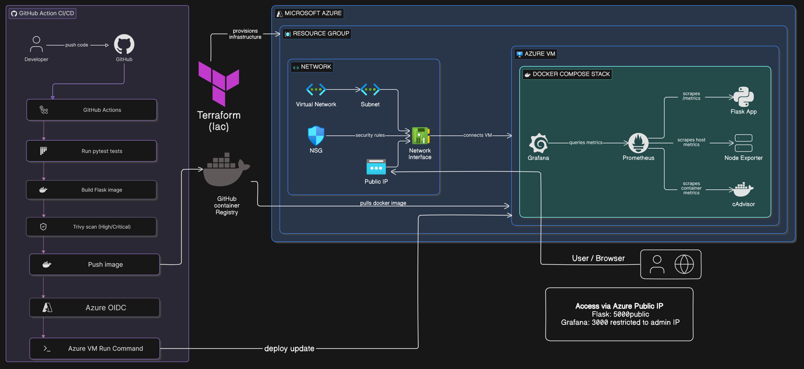

The application runs on an Azure Linux VM using Docker Compose.

Terraform provisions the Azure infrastructure, while GitHub Actions handles application CI/CD. Prometheus collects application, host and container metrics, while Grafana provides visualization and alerting.

## Dashboard Preview

### Flask Dashboard

The status badge is driven by the application's own data rather than being a fixed label, so it reports the real state. When the container is stopped the badge turns red and the figures stay at their last successful reading.

| Application healthy                                                       | Application unreachable                                                                       |
| ------------------------------------------------------------------------- | ----------------------------------------------------------------------------------------------- |
| 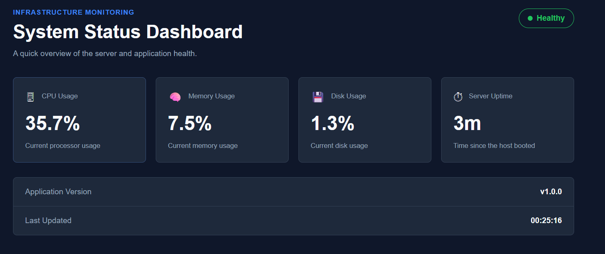 | 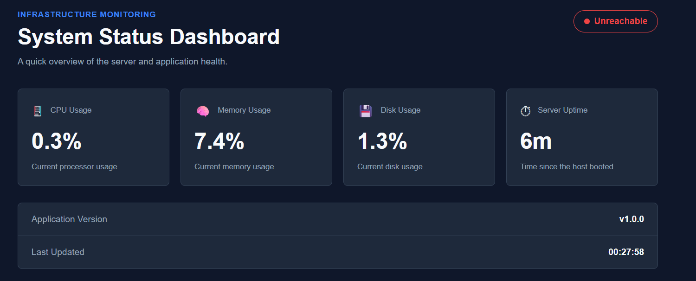 |

### Health Check

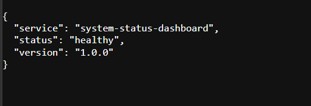

### Grafana Dashboard

| Application Health                                                                         | Application Traffic and Performance                                                                      |
| ------------------------------------------------------------------------------------------ | -------------------------------------------------------------------------------------------------------- |
| 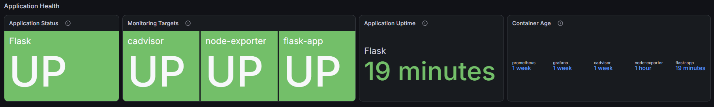 | 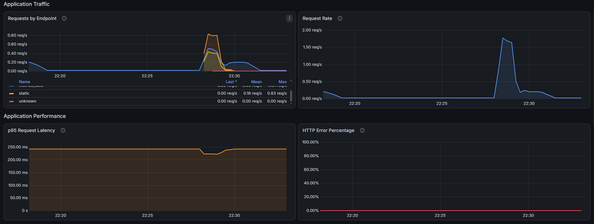 |
| **Server Metrics**                                                                         | **Container Metrics**                                                                                    |
| 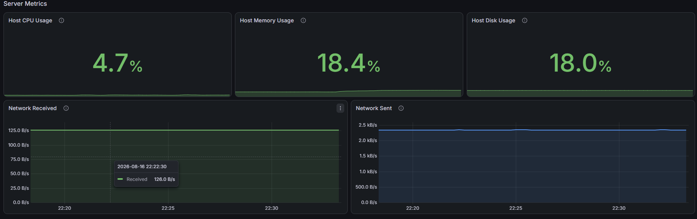         | 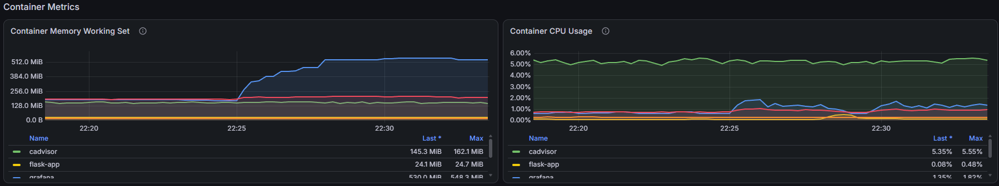                 |

## Tech Stack

| Technology                | Purpose                                      |
| ------------------------- | -------------------------------------------- |
| Flask + Gunicorn          | Provides the dashboard and API endpoints     |
| Docker Compose            | Runs and manages the containerized services  |
| Prometheus                | Collects and stores monitoring metrics       |
| Grafana                   | Displays dashboards and evaluates alerts     |
| Node Exporter             | Provides Linux host metrics                  |
| cAdvisor                  | Provides Docker container metrics            |
| Terraform                 | Provisions the Azure infrastructure          |
| Azure Linux VM            | Hosts the application and monitoring stack   |
| GitHub Actions            | Runs tests, scanning and deployment          |
| GitHub Container Registry | Stores the Flask Docker image                |
| Trivy                     | Scans the image for security vulnerabilities |
| pytest                    | Tests the Flask application                  |

## How It Works

1. The developer pushes code to GitHub.
2. GitHub Actions runs pytest, builds the Flask Docker image and scans it with Trivy.
3. The approved image is pushed to GitHub Container Registry.
4. GitHub Actions authenticates to Azure using OIDC.
5. If the Azure environment is running, Azure VM Run Command starts the deployment on the VM.
6. The VM pulls the latest Flask image and recreates the Flask service with Docker Compose.
7. Prometheus collects application, host and container metrics.
8. Grafana queries Prometheus and displays dashboards and alerts.
9. Users access the Flask dashboard and Grafana through the Azure VM public IP, subject to the Network Security Group rules.

## Monitoring & Observability

Prometheus collects metrics from the Flask application, Node Exporter and cAdvisor.

- Flask exposes application metrics through `/metrics`
- Node Exporter provides host CPU, memory, disk and network metrics
- cAdvisor provides container CPU and memory metrics
- Grafana queries Prometheus and visualizes the metrics in dashboards
- Grafana alerts detect application and resource issues, and send them to a Discord webhook

Three alert rules are provisioned as code in `grafana/provisioning/alerting/alert-rules.yml`:

| Alert                  | Condition                        | Severity |
| ---------------------- | -------------------------------- | -------- |
| Flask Application Down | `up{job="flask-app"} < 1` for 1m | critical |
| High Host CPU Usage    | CPU above 85% for 5m             | warning  |
| High Host Disk Usage   | Root filesystem above 85% for 5m | warning  |

The rules are created from that file when Grafana starts, so the monitoring setup can be recreated from scratch rather than clicked together in the UI:

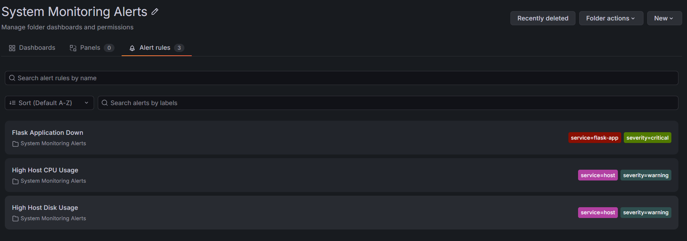

Alerts are delivered to a Discord webhook, so a failure reaches me instead of only turning red in a dashboard nobody is watching.

All three scrape targets, checked at `http://localhost:9090/targets`:

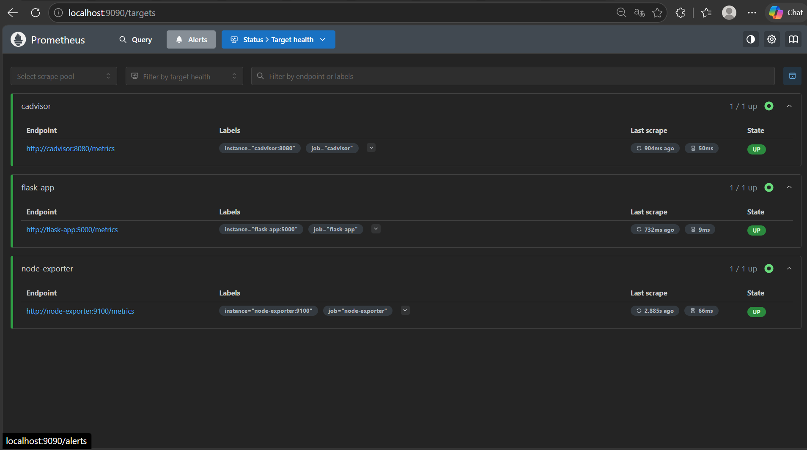

The project focuses on metrics-based observability. Container logs are available through Docker, while distributed tracing is not included because the application runs as a single Flask service.

## CI/CD Pipeline

The project uses GitHub Actions to automate testing, security scanning, image publishing and deployment.

Pipeline flow:

1. Code is pushed to the `main` branch.
2. `pytest` runs the Flask application tests.
3. A Docker image is built.
4. Trivy scans the image for High and Critical vulnerabilities.
5. The image is pushed to GitHub Container Registry.
6. GitHub Actions authenticates to Azure using OIDC.
7. Azure VM Run Command starts the deployment.
8. The VM pulls the latest image and recreates the Flask service with Docker Compose.

Pull requests run the testing, build and security scan stages. Image publishing runs only for pushes to `main`. Deployment runs only when the Azure environment exists — see the deployment switch below.

## Azure Infrastructure

Terraform provisions the Azure infrastructure used to host the application and monitoring stack.

The deployed resources include:

- Resource Group
- Virtual Network
- Subnet
- Network Security Group
- Static Public IP address
- Network Interface
- Azure Linux Virtual Machine

The Azure VM runs Ubuntu Linux and hosts the Docker Compose stack containing the Flask application, Prometheus, Grafana, Node Exporter and cAdvisor.

### Deploying

Terraform needs a `terraform.tfvars` file, which is gitignored. The variables without defaults are `subscription_id`, `admin_ip_cidr` (your public IP in CIDR form, from `curl -s ifconfig.me`) and `ssh_public_key_path`.

```bash
cd terraform
terraform init
terraform plan
terraform apply
```

Terraform provisions the infrastructure. Docker and the monitoring stack are then installed on the VM once, by hand — clone the repository, create the `.env` as described in Local Setup, and run `docker compose up -d`. Automating that step with cloud-init is in Future Improvements.

After that, GitHub Actions deploys new versions of the Flask container automatically. Changes to the monitoring configuration still need a `git pull` on the VM.

### Cost and the deployment switch

This runs on a personal Azure subscription, so the infrastructure is created when it is needed and destroyed again afterwards:

```bash
terraform destroy
```

Because the VM is not running most of the time, the two Azure steps in the pipeline are gated on a repository variable, `DEPLOY_TO_AZURE`. Set it to `true` when the environment exists; leave it unset and those steps are skipped, so the rest of the pipeline still runs and passes. Testing, image building, security scanning and publishing to GHCR do not depend on Azure at all.

## Security

- The application is served by Gunicorn, not the Flask development server, and the container runs as a non-root user.
- Grafana requires an admin password from the environment. Docker Compose refuses to start if it is not set, instead of falling back to the default `admin`/`admin`.
- All container image versions are pinned, so the stack is the same every time it is rebuilt.
- Node Exporter mounts only the host paths it needs instead of all of `/`, so it cannot read files like `/etc/shadow`.
- GitHub Actions authenticates to Azure using OpenID Connect (OIDC). No Azure password or client secret is stored in GitHub.
- SSH access on port `22` is restricted to the administrator IP address, password authentication is disabled, and access requires an SSH key.
- Grafana access on port `3000` is restricted to the administrator IP address.
- Trivy scans the Docker image and fails the pipeline when High or Critical vulnerabilities are detected, before the image is published.
- Prometheus, Node Exporter and cAdvisor are not published publicly. Prometheus is bound to `127.0.0.1` and reachable over an SSH tunnel.
- Only the Flask dashboard on port `5000` is publicly exposed, for demonstration.
- Terraform state, variable files, `.env` files and local plans are excluded from Git using `.gitignore`.

Known limitation: cAdvisor needs the Docker socket to see the containers. Mounting it `:ro` makes the socket file read-only but not the Docker API, so anything that could write to it could reach the Docker daemon. That is unavoidable with cAdvisor, so the service is never published outside the Docker network.

## Failure Detection and Recovery

The monitoring setup was tested by intentionally stopping the Flask container and observing how the system responded.

Test flow:

1. The Flask container was stopped.
2. The dashboard status badge changed from `Healthy` to `Unreachable`.
3. Prometheus detected that the application target was unavailable.
4. Grafana displayed the application as `DOWN` and the alert moved to `Firing`.
5. A notification arrived in Discord.
6. The Flask container was started again.
7. Prometheus detected the recovered service and Grafana returned it to `UP`.
8. A second Discord message confirmed the alert had resolved.

This test demonstrates that the monitoring stack detects an application failure, notifies me about it, and confirms recovery after the service is restored.

### Application Failure Detected

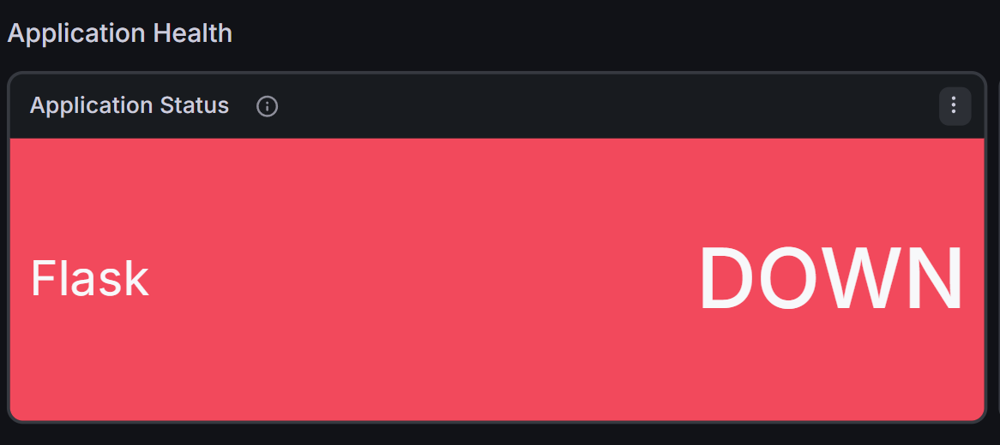

### Alert Firing

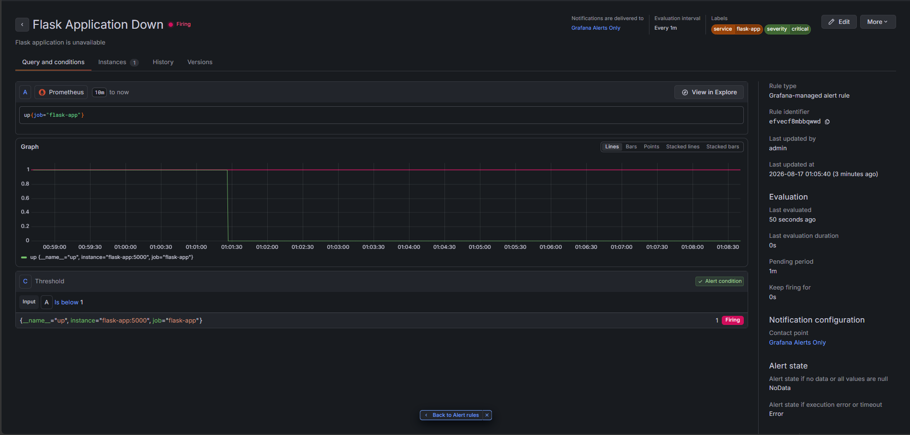

### Notification Delivered

The alert reaches Discord rather than only turning red in the Grafana UI, and a second message is sent when it resolves.

| Firing                                                                      | Resolved                                                                        |
| --------------------------------------------------------------------------- | --------------------------------------------------------------------------------- |
| 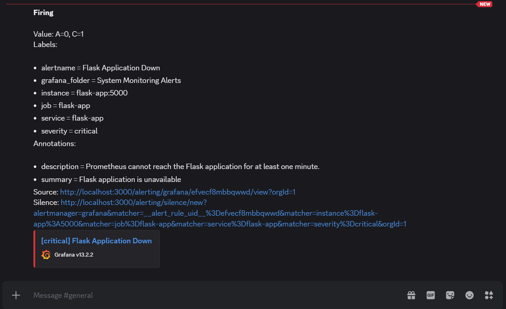 | 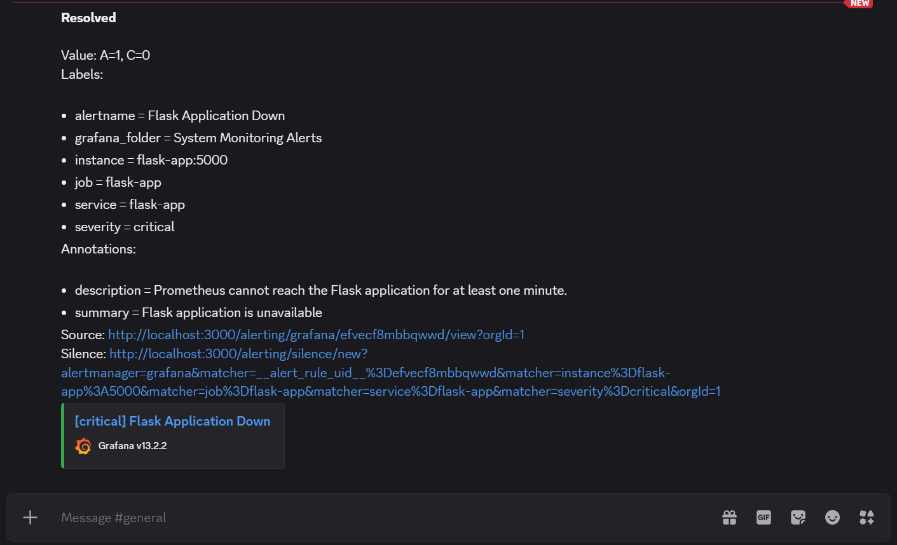 |

## Local Setup

### Prerequisites

- Docker with Docker Compose
- Git

Clone the repository.

```bash
git clone https://github.com/aden-farah/system-status-dashboard.git
cd system-status-dashboard
```

Create a `.env` file next to `docker-compose.yml`. It is gitignored and never committed.

```bash
GRAFANA_ADMIN_PASSWORD=pick-something-long
DISCORD_WEBHOOK_URL=
```

Compose will not start without `GRAFANA_ADMIN_PASSWORD`, which is deliberate — it stops Grafana quietly falling back to its default `admin`/`admin`.

Start the monitoring stack. `--build` builds the Flask image from `./app`, so local code changes are picked up.

```bash
docker compose up -d --build
```

Confirm that the containers are running.

```bash
docker compose ps
```

Verify the Flask health endpoint.

```bash
curl http://localhost:5000/health
```

Open the Flask dashboard.

```text
http://localhost:5000
```

Open Grafana. Log in as `admin` with the password from your `.env`.

```text
http://localhost:3000
```

Prometheus is bound to localhost and not published to the network.

```text
http://localhost:9090
```

Stop the monitoring stack.

```bash
docker compose down
```

## Project Structure

```text
system-status-dashboard/
├── .github/
│   └── workflows/
│       └── pipeline.yml
├── app/
│   ├── static/
│   │   ├── script.js
│   │   └── style.css
│   ├── templates/
│   │   └── index.html
│   ├── app.py
│   ├── Dockerfile
│   ├── requirements.txt
│   └── test_app.py
├── docs/
│   └── screenshots/
│       ├── architecture/
│       ├── healthy/
│       │   └── grafana-dashboard/
│       └── unhealthy/
│           └── grafana-dashboards/
├── grafana/
│   ├── dashboards/
│   │   └── system-status-dashboard.json
│   └── provisioning/
│       ├── alerting/
│       ├── dashboards/
│       └── datasources/
├── prometheus/
│   └── prometheus.yml
├── terraform/
│   ├── main.tf
│   ├── network.tf
│   ├── outputs.tf
│   ├── provider.tf
│   ├── variables.tf
│   └── vm.tf
├── docker-compose.yml
├── .gitignore
└── README.md
```

## Challenges and Lessons Learned

- Azure VM sizes are not always available in every region because of capacity restrictions. I learned how to check regional availability and adjust the deployment when required.
- Terraform state must remain synchronized with the actual Azure infrastructure. I learned to review Terraform plans and inspect the state before applying changes.
- Node Exporter required access to the host filesystem to provide accurate Azure VM metrics while running inside a container.
- Grafana dashboards and alert rules must be provisioned as code so the monitoring environment can be recreated consistently.
- Azure OIDC requires the federated identity configuration to match the GitHub Actions identity correctly.
- Testing application failure and recovery helped me understand how Prometheus target health and Grafana alerts react when a service goes down and recovers.
- Docker service names allow Prometheus, Grafana and the exporters to communicate through the internal Docker network without exposing every service publicly.
- Building the project end-to-end helped me understand how containers, monitoring, CI/CD, infrastructure as code and Azure networking work together as one system.

## Future Improvements

- Bootstrap the VM with cloud-init so `terraform apply` installs Docker and starts the stack, instead of setting it up by hand
- Tag images by commit SHA instead of `latest`, so it is possible to tell which build is running and roll back
- Store Terraform state remotely in Azure Storage
- Add HTTPS with a custom domain and reverse proxy
- Automate deployment of Docker Compose and Grafana configuration changes, not just the application container
